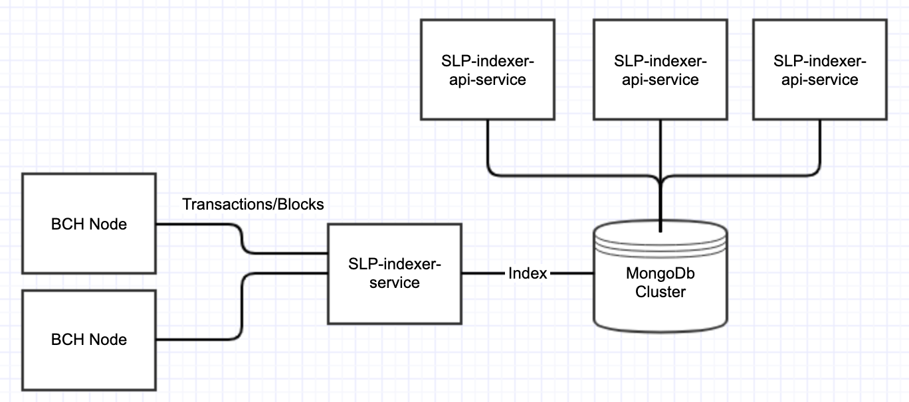
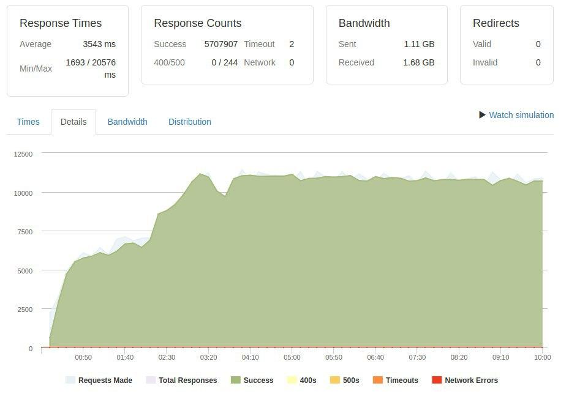

# Bitcoin.com SLP-Indexer
**last updated:** 2019-12-16

* 1. [What is our SLP-indexer?](#what)
* 2. [Architecture](#architecture)
* 3. [Performance](#performance)
* 4. [Feature improvements](#improvements)
* 5. [Setup](#setup)
* 6. [How do you query for data?](#query)

##  1. What is our SLP-Indexer?
Bitcoin.com SLP-indexer is a service that listens to the Bitcoin Cash blockchain for SLP-token transactions.
When it finds an SLP transaction it will parse, validate and save it in the database for easy and fast access.

This indexer is built to scale and for high performance services requiring high uptime and scalability. At Bitcoin.com we use this indexer
to handle SLP transactions to our native wallet across several global server locations. The health-check system makes it is easy
to setup advanced DNS-failover strategies in AWS or any other cloud provider.

Why should you run this indexer compared to the alternatives on the market? Our top priority during the development of this indexer was to support
businesses with requirements on stability and scalability. It was meant to be a full enterprise solution for companies to support high volume
SLP trading on an exchange where you need to rely on a close to 100% uptime. It also has the ability to make updates and bug fixes without any downtime
which was a strong businesses requirement.

##  2. Architecture
The service consist of one writer and several readers services. We use MongoDb as the storage and add indexes on
the fields that we need to query. The reason we have split readers and writers into separate services is that we want to have the ability
to scale our readers separately.

It is not recommended to have more than one reader as they will read the same data from the blockchain and then
insert the same items creating a heavier load on your MongoDb. It is possible to run more writers if you really
need redundancy in case of failure.

You can deploy as many readers as you want and we recommend at least 2 readers for redundancy. Deploying more readers
will allow the api to handle more requests. But if your MongoDb cluster cannot handle the API load you will not increase
performance. A good idea is if you need a lot of readers to also scale the MongoDb cluster.

It is also recommended to run your readers on a separate machine than the writer. In the case of a DDOS or heavy load on your
readers you don't run the risk of also crashing the writer.

We also recommend you run two or more nodes close to the location of the writer and connect your writer only to those nodes.
This gives you full control over the nodes it connects to and also speeds up the time the indexer picks up a transaction from the time it was
seen in the mempool of the node. We recommend two nodes since it gives you redundancy if one node goes down or has trouble.

## 3.  Performance
When we tested the performance of the indexer we used loader.io to generate requests on the api. We ran test-suits to
figure out the performance levels and also response times with heavy load.

The graph below shows one of our tests running with 1 m5.large handling requests from loader.io. As you can see it 
can handle a lot of clients per second and if more is needed then we can deploy another instance. 

Currently in Bitcoin.com production we run 2 t3.medium which gives us the performance needed to serve request 
from our Bitcoin.com wallet and rest.bitcoin.com without any issues. If we need more performance
we either deploy more machines to spread the load or deploy bigger machines. We are using auto-scaling groups to scale up/down
as needed if the load increases or decreases.

## 4.  Future improvements
There is still some improvements that could be made to this project to scale it even further.

* **Enable full-indexing support** Currently the indexer filters out SLP only transactions. It has the ability to index the entire blockchain into mongodb
which would give you the ability to query for normal BCH transactions as well. Some performance issues was noted during full-indexing testing related
to the time of the initial sync. This could be improved by handling more than one block at the time during initial sync. Also a more efficient mongodb querying strategy
for batches would decrease initial sync time.

* **More API implementations** To make this data available for everyone to use and contribute to another API layer built in another language like JavaScript would
be a great addition to the project. This would give anyone regardless or preferred language the ability to contribute and build on top of the MongoDb slp-data that we
have from the indexer.

* **Sharding MongoDb** As the blockchain grows there might be a need to use sharding for MongoDb. This will help with scaling the queries and the MongoDb to support large datasets. Currently this is not needed.

* **Zeromq connection to the node** Add support for zeromq connection to the node. Currently the app uses BitcoinJ for connections to the nodes. These connections sometimes disconnect after running for a while mostly when the connected nodes goes offline for a long time. Zeromq would be add an extra way for transactions to be picked up by the indexer and it is likely it is faster than using BitcoinJ.

* **Caching** To improve the querying speed a distributed cache can be added. The writer will then write to both mongodb and to the cache
and the API will try to read data from the cache if it is there or read from mongodb if the data is not available. Doing so
would increase the throughput of the API and allow for bigger loads without the need to scale mongodb.

##  5. Setup

### What do I need to run the services?
* 1. Java 11
* 2. MongoDb/Amazon DocumentDb
* 3. Bitcoin Cash Node. Either connect to a public node or your own

### What do I need to build it?
* 1. Java 11
* 2. Maven

### How do i build it?
`cd slp-indexer`

`cd slp-indexer-service`  
`mvn clean install`

`cd slp-indexer-api-service`  
`mvn clean install`

### How do i run it?
These steps below is how we run it on a Ubuntu machine    
Create this folder on your machine
`mkdir /var/blockchain/indexer/`
`chown user:user -R /var/blockchain/indexer`

Change these settings in the `slp-indexer-service-app/src/main/resources/application-prod.properties`
to what is applicable for you

`bitcoinj.max.connection=MAX_AVAILABLE_NODES` This settings is for how many nodes you want to connect to  
`bitcoinj.awaiting.peer=PEERS_NEEDED_FOR_STARTUP` How many connected peers is needed for the service to start  
`dns.discovery=DNS_TO_YOUR_NODES` If you want to use DNS seeding then specify your address here  
`spring.data.mongodb.uri=CONNECTIONSTRING` MongoDb connectionsString  
`spring.data.mongodb.database=slpblockchain` MongoDb databasename

There is several ways of running the jar file. You can run it in a a docker container or using systemd. Whatever works
best for your case.

To run the Writer follow the build instructions and when you have built the project find the jar.  
`slp-indexer-service-app/target/slp-indexer-service-app-0.0.1-SNAPSHOT-exec.jar`

To run the jar use the command  
`java -jar -Dspring.profiles.active={prod/localhost/test} slp-indexer-service-app-0.0.1-SNAPSHOT-exec.jar`  

Example : `java -jar -Dspring.profiles.active=localhost slp-indexer-service-app-0.0.1-SNAPSHOT-exec.jar`

To run the Reader follow the build instructions and find the jar.
`slp-indexer-service-api-app/target/slp-indexer-service-app-0.0.1-SNAPSHOT-exec.jar`

To run the jar use the command  
`java -jar -Dspring.profiles.active={prod/localhost/test} slp-indexer-api-service-app-0.0.1-SNAPSHOT-exec.jar`  

Example : `java -jar -Dspring.profiles.active=localhost slp-indexer-api-service-app-0.0.1-SNAPSHOT-exec.jar`

##  6. How do you query for data?
The reader has a REST api which connects to the MongoDb cluster.

These are the endpoints which are currently supported. You can find more information about the endpoints in the swagger
docs http://localhost:1337/api/swagger-ui.html#/ or here https://rest.bitcoin.com/

GET validateTxid/{txId}

POST validateTxid

GET list/{tokenId}

POST list/

GET tokenStats/{tokenId}

POST tokenStats

GET balancesForAddress/{address}

POST balancesForAddress

GET balancesForToken/{tokenId}

GET balance/{address}/{tokenId}

GET burnTotal/{transactionId}

GET recentTxForTokenId/{tokenId}/{page}
